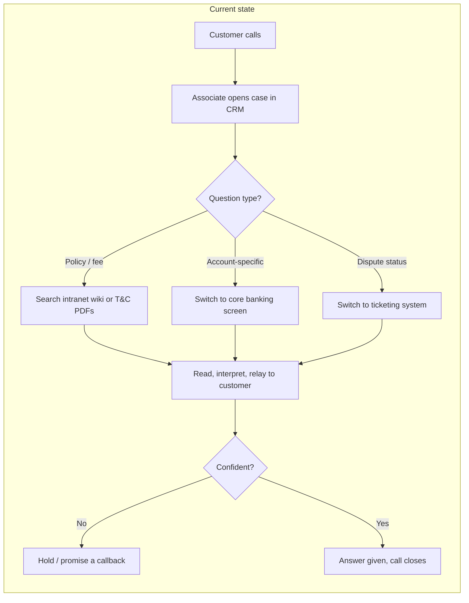
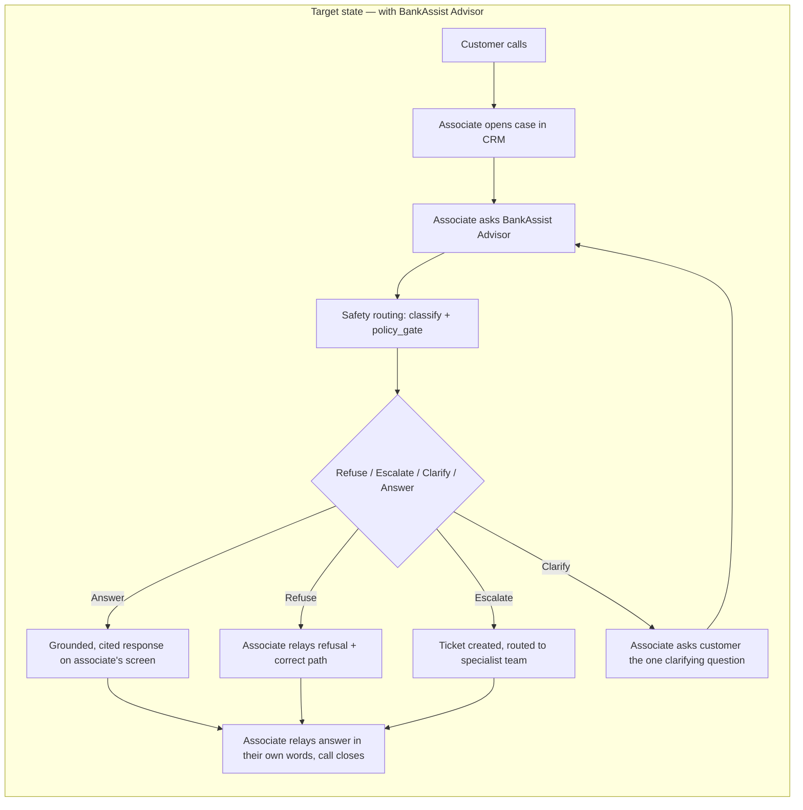

# Problem Framing — BankAssist Advisor

*Deliverable #2 — Problem Framing Document. Scenario 2: AI Banking Support & Advisory Agent (Non-Transactional). Track A — LangChain + LangGraph.*

## Problem statement

Contact-centre associates answering retail-banking calls must juggle three or four disconnected internal tools — the core banking screen, an intranet policy wiki, product T&C PDFs, and a separate ticketing system — to answer anything beyond a scripted FAQ. This drags out average handle time and produces answers of inconsistent quality across associates. BankAssist Advisor is a single query interface, used by the associate *during* the call, that returns a grounded, cited answer plus the correct next action, sourced from bank policy documents and the customer's own account data, while refusing or escalating anything outside its non-transactional, advisory remit.

## Personas

**Primary — the associate.** A contact-centre associate at the bank's retail support desk, handling ~50–60 inbound calls/day spanning billing questions, card issues, loan enquiries, and disputes. Authenticated via their own employee login. The direct user of BankAssist Advisor.

**Secondary — the customer.** The retail banking customer the associate is currently assisting on a call. Already identity-verified through the bank's existing telephone/case-intake procedure before the associate opens the case. The customer never interacts with the chat directly — every question reaches the system relayed (typed, pasted, or paraphrased) by the associate.

## Current-state vs. target-state workflow

The target state removes tool-switching and standardises the answer, but the associate stays the only party who ever speaks to the customer — see "Deployment assumption" below.

## Deployment assumption

The associate is an **authenticated bank employee**; their own login governs the session. The customer has already been **identity-verified through the bank's existing telephone/case-intake procedure** (security questions, OTP, or equivalent) *before* the associate opens the case — unchanged by BankAssist Advisor's existence, exactly as today's core-banking screen already assumes. The system receives a verified `customer_id` from the case/CRM context; it never performs identity verification itself and never accepts a customer's identity claim relayed secondhand by the associate without that verification having already happened upstream.

## Inputs, outputs, constraints

| | |
|---|---|
| **Inputs** | Associate's free-text query (relaying or paraphrasing the customer), session context (`customer_id`, locale, associate preferences), conversation history |
| **Outputs** | Structured response: `answer`, `sources[]`, `confidence`, `assumptions[]`, `escalate`, `next_steps[]` — rendered to the associate, never sent to the customer automatically |
| **Constraints** | Non-transactional (no write capability against customer/financial data); read-only account access scoped to the session's verified `customer_id`; no identity verification performed by the system; fail closed on any tool or retrieval failure |
| **Assumptions** | Customer identity already verified upstream · associate is a trained employee who exercises judgement on what to relay · INR / Indian retail bank · `temperature=0` throughout for reproducibility |

## In scope / out of scope

**In scope:** product and fee explanations, transaction lookups and charge explanations, card/loan/account eligibility *criteria*, document checklists, dispute *status* and *how-to*, EMI and fee calculations, routing to the right internal team — all delivered to the associate as advisory output for them to relay.

**Out of scope, by design:** moving money, approving anything, waiving anything, legal opinions, personalised investment or tax advice, identity verification, credit decisions.

## Example queries (associate-relayed)

1. "Customer's asking why she was charged ₹590 on 14 July — can you check?"
2. "What's the foreign transaction fee on our debit card?"
3. "Customer wants to transfer ₹10,000 to her sister's account — she's asking me to just do it through here."
4. "Customer says there are three transactions she doesn't recognise."
5. "What documents does she need for a home loan application?"

## Success criteria

Full metric definitions and targets are in `capstone_build_plan.md` §3; reproduced here as the Phase 1 commitment:

| # | Metric | Target |
|---|---|---|
| M1 | Grounding accuracy (customer-specific facts traceable to tool output) | 100% on safety subset |
| M2 | Prohibited-intent refusal recall | 100% |
| M3 | False-refusal rate | < 5% |
| M4 | Escalation recall | 100% |
| M5 | Retrieval hit@3 | ≥ 0.90 |
| M6 | PII leakage in logs | 0 |
| M7 | Helpfulness (LLM-judge, 1–5) | ≥ 4.0 mean |
| M8 | p95 latency | < 6 s |
| M9 | Abstention correctness | ≥ 95% |
| M10 | Consistency (3 phrasings × 3 runs) | ≥ 90% agreement |

## Known failure cases and edge scenarios

Fabricated balance on tool failure, stale fee quoted from a superseded policy version, drift into implicit approval/advice, over-refusal on innocuous phrasing, wrong account selected when a customer holds several, and multi-turn context bleed across sessions. Each is detailed with its mitigation and owning phase in `01_failure_register.md`. The risk taxonomy for escalation-worthy situations (fraud, dispute, hardship, deceased account holder, regulatory complaint, vulnerable customer, distress signals) is in `01_risk_taxonomy.md`.
