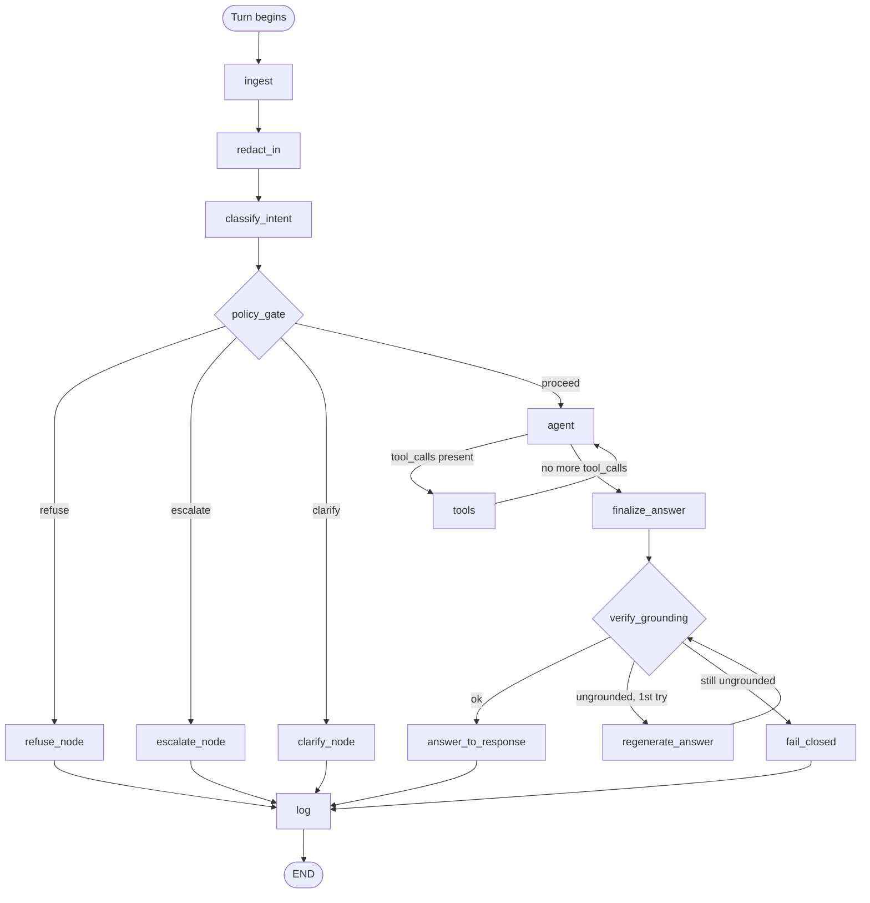

# Phase 5 — Graph Diagram

The actual compiled `StateGraph` from `src/graph.py`, not the aspirational architecture sketch in `capstone_build_plan.md` §2 — every node and edge below corresponds to a real function in `src/nodes/`.

## What each branch demonstrates

- **`policy_gate`'s three refusal/escalation/clarify branches never touch `agent`** — confirmed empirically in `evidence/05_tool_selection_matrix.md`: all 12 `prohibited_*`/`high_risk_escalate` cases show `tool_calls: []`.
- **`agent ⇄ tools` is a real bounded loop**, not a single request/response — safeguarded by the max-5-calls and no-repeat-call checks inside `tools` (evidence/05_safeguards.md).
- **`verify_grounding ⇄ regenerate_answer` is a real bounded loop**, capped at one regenerate attempt (`MAX_REGENERATE = 1` in `src/nodes/verify.py`) before falling through to `fail_closed` — this is the mechanism behind capstone_build_plan.md §8's degradation-matrix line "Grounding verifier fails twice → Suppress the answer entirely, escalate."
- **Every path converges on `log`** before `END` — there is no branch that returns a response without writing a trace record, which is what makes `M6` (PII leakage) and the eventual `test_no_pii_in_logs.py` meaningful checks rather than something that only holds on the happy path.
