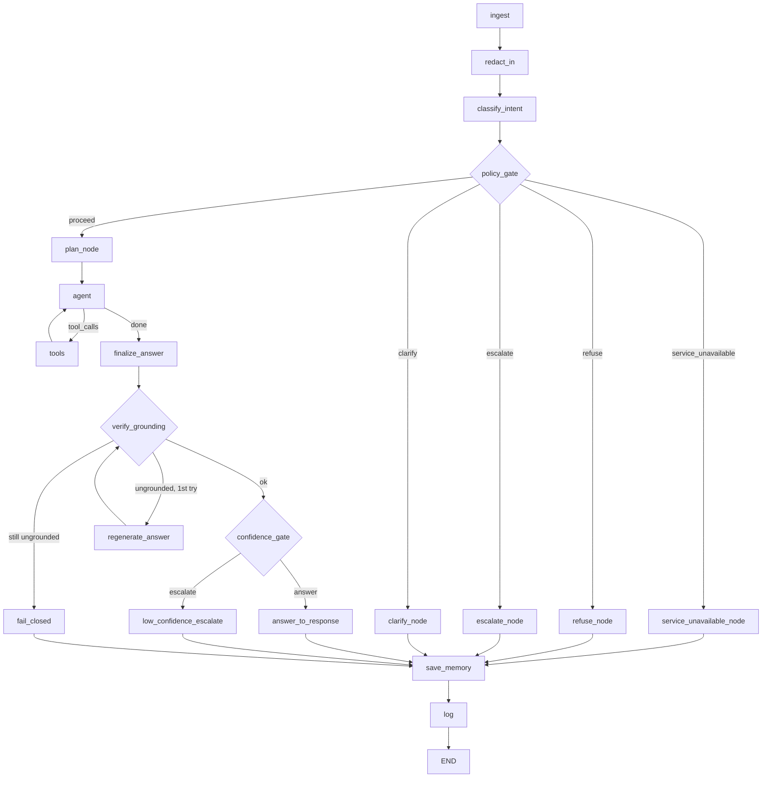

# Phase 8 — Deployment Readiness

## Architecture recap

`src/graph.py` compiles a single LangGraph `StateGraph`. `src/api.py` (FastAPI: `POST /chat`, `POST /feedback`, `GET /health`) and `app.py` (Streamlit) are both thin callers of `graph.run_turn()` / `graph.give_feedback()` — all actual logic lives in the graph itself, so the two front ends can never drift out of sync with each other's behaviour.

## Deployment assumptions

- **Both local (Docker) and cloud (Streamlit Community Cloud) deployment are supported and verified**, superseding an earlier local-only plan. Live demo: **https://arindamsarkar-bankassist-advisor-x7yak6ejhgdnfoy4bpaapy.streamlit.app/** (Streamlit UI only — Community Cloud does not host the FastAPI layer, see below). Verified with real turns end-to-end on the deployed instance (e.g. a foreign-transaction-fee question correctly cited the current, not stale, fee schedule; an account-balance question returned the exact figure from `data/customers.json`) — not just a boot check.
- **`app.py` bridges Streamlit's `st.secrets` into `os.environ`** (`OPENAI_API_KEY`, `OPENAI_MODEL_AGENT`, `OPENAI_MODEL_JUDGE`), only when a variable isn't already set, so the same code path works locally via `.env` and on Community Cloud via its Secrets panel with no per-environment branching elsewhere in the codebase. Wrapped in a try/except for `StreamlitSecretNotFoundError`, since accessing `st.secrets` at all raises when no `.streamlit/secrets.toml` exists (the normal local case) — confirmed by reproducing the crash locally before adding the guard.
- **The associate is an authenticated bank employee; the customer has already been identity-verified upstream** (docs/01_problem_framing.md) — the API's `customer_id` field is trusted as-is, exactly as a real deployment would trust it after its own auth layer. This demo has no auth middleware in front of `/chat`/`/feedback`; a real deployment would add one (see Limitations).
- **The Chroma vector store is committed**, not rebuilt at container start — `data/policy_corpus/*.md` changing without re-running `src/ingest.py` would silently serve stale embeddings. Documented, not automated, for this capstone's scope.
- **Session state (`data/memory_store.json`, `data/feedback_store.jsonl`, `data/escalation_queue.jsonl`) is process-local JSON/JSONL files**, not a real database. Fine for local/Docker use; on Streamlit Community Cloud's free tier the filesystem is also ephemeral, so these additionally won't survive a redeploy or the platform's idle-sleep there. Either way, a real datastore (Postgres, Redis) would be needed for multi-instance deployment, since concurrent writers to the same JSON file would race.

## Why LangSmith tracing is off by default

`capstone_build_plan.md` §0.3 flagged this at the very start of the project: LangSmith's default tracing ships full conversation payloads to a cloud service, which directly conflicts with "must not store PII in logs" (the scenario's core safety requirement). This project's own structured logger (`src/nodes/log.py` + `src/observability.py`) was built specifically to avoid that trade-off — the trace record holds ids, codes, counts, and timing, never message text (see `Phase_9/docs/09_evaluation_report.md`'s `test_no_pii_in_logs.py` for the enforcement test). LangSmith was never enabled in this codebase; there is no env flag gating it because it was never wired in at all, which is a stronger guarantee than "off by default."

## Structured logging (capstone_build_plan.md §8's field list)

Every turn writes one JSONL record to `logs/trace.jsonl`: `trace_id`, `session_hash` (salted, never the raw `customer_id`), `intent`, `risk_level`, `route`, `tools_called`, `tool_call_count`, `doc_ids_cited`, `refusal_code`, `escalation_code`, `confidence`, `grounding_ok`, `regenerate_count`, `outcome`, `node_latencies_ms` (per-node timing, via `observability.instrument_node`), `total_latency_ms`, `token_usage` (prompt/completion/total, via `observability.accumulate_tokens`). No message text, no names, no account numbers, no amounts — confirmed by inspection of the field list itself, not just by policy.

## Graceful degradation matrix — measured, not just designed

| Failure | Required behaviour | What actually happens | Evidence |
|---|---|---|---|
| LLM timeout / 429 | 1 retry w/ backoff → apologise + escalation, never partial | `src/resilience.py`'s `invoke_with_retry`/`invoke_structured_with_resilience`, applied at every LLM call site | `evidence/08_graceful_failure.md` §1 |
| Vector store unavailable | Account-lane only, explicitly unavailable | In practice: the 8s tool timeout (Phase 5) catches it, the answer fails ungrounded, and Phase 7's `confidence_gate` escalates — a stricter fail-closed behaviour than literal "account-lane only," and documented as a deliberate deviation, not an oversight | `evidence/08_graceful_failure.md` §2 |
| Account API down | "Can't retrieve account details" + escalation, never estimates | New in Phase 8: `AccountServiceUnavailable` + a dedicated `service_unavailable_node`, since `customer_instrument_directory()` is called directly from `classify_intent`/`agent_node`/`clarify_node`, outside the tool-call safety net that already covered in-tool failures | `evidence/08_graceful_failure.md` §3 |
| Grounding verifier fails twice | Suppress answer, escalate, fail closed | Already built in Phase 5/7 (`fail_closed_node`) | `Phase_5/evidence/05_safeguards.md`, re-verified `evidence/08_graceful_failure.md` §4 |
| Malformed LLM JSON | 1 repair attempt → safe fallback | `invoke_structured_with_resilience`'s repair-retry path | `evidence/08_graceful_failure.md` §5 |

**Honest deviation from the literal design, worth calling out on its own:** the build plan's original wording for "vector store unavailable" was "account-lane only." What's actually built is stricter — a policy-lookup failure escalates the whole turn rather than attempting a partial, policy-free answer. This was a considered choice, not a shortfall: for a mixed question (needing both policy and account facts), silently degrading to "answer only the account half" risks producing a technically-true-but-incomplete answer the associate might relay as if it were complete. Fail-closed-and-escalate is consistent with every other safety decision in this project (capability by omission, fail-closed tools, the grounding verifier) — this document names the deviation explicitly rather than letting the original design doc quietly become inaccurate.

## Limitations

- **No authentication middleware on `/chat` or `/feedback`** — `customer_id` is trusted as a plain request field. A real deployment sits this API behind whatever authenticates the associate's session (per the deployment assumption in `docs/01_problem_framing.md`) and derives `customer_id` from that, never from an unauthenticated request body.
- **Docker build not verified in this environment** — Docker isn't installed in the sandbox this project was built in, so `Dockerfile`/`docker-compose.yml` follow standard, well-established patterns but were not build-tested end-to-end. Documented honestly rather than claimed as verified.
- **No load/concurrency testing** — the latency evidence (`evidence`/`logs/latency_errors.csv`) is sequential single-turn timing, not concurrent-request behaviour.
- **p95 latency exceeds the M8 target of < 6s — measured, not estimated.** 56 real turns (`Phase_8/logs/latency_errors.csv`): **p50 = 5,632 ms** (just under target), **p95 = 15,247 ms** (well over), **max = 160,524 ms**, **0 errors**. The dominant cost is 4-5 sequential LLM calls per turn (classify → plan → agent [→ tools → agent] → finalize [→ regenerate]); the two extreme outliers (AMB-03 and UNA-03, both >80s on their first pass, both <10s on their second) look like genuine OpenAI API latency spikes that Phase 8's new retry logic correctly rode out rather than failing on — the honest read is "resilience worked as designed," not "resilience caused the slowness." A real optimization pass (e.g., combining classify+plan into one call, or skipping planning for clearly single-step turns) is on the Phase 9 roadmap rather than attempted late in this build.
- **Deployment screenshots**: this environment has no browser/screenshot tooling available. The app is genuinely live and verified working (see the deployment-assumptions section above for the two real, correctly-answered questions run against the deployed URL, not a local instance), but the actual screenshot images still need to be captured by hand and added as evidence before submission.
